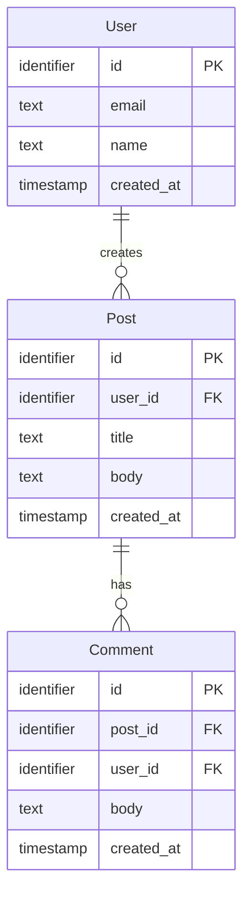

## User Input

```text
$ARGUMENTS
```

If user input names specific entities, scope to those. Otherwise, extract entities from spec.md.

## Execution flow

### Step 1 — Read inputs
- `.specify/specs/[active]/spec.md` → "Key Entities" section + any entity-like nouns in user stories
- `.specify/specs/[active]/plan.md` → relationships implied by the implementation approach

### Step 2 — Extract entities
For each candidate entity:
- **Name** (singular, PascalCase)
- **Purpose** (1 line)
- **Key attributes** (no implementation types — just `id: identifier`, `name: text`, `email: text`, `created_at: timestamp`, etc.)
- **Relationships** (cardinality with other entities)

### Step 3 — Generate Mermaid erDiagram



### Step 4 — Apply 5 ERD guardrails

| # | Guardrail | Action on failure |
|---|-----------|------------------|
| 1 | Every entity has a PK | Add `PK` annotation; warn user if name is ambiguous |
| 2 | Every FK references an existing entity | Auto-add the referenced entity as a stub if missing; warn user |
| 3 | Cardinality is explicit (`\|\|--o{`, `}o--o{`, etc.) | Default to `\|\|--o{` (one-to-many); warn if ambiguous |
| 4 | Entity names are PascalCase singular | Auto-correct; warn if collision results |
| 5 | All attributes from spec.md "Key Entities" are represented | Add missing attributes; warn user with list |

If any guardrail failed → write the Mermaid anyway but **prepend a TODO block** listing the warnings:

```markdown
> ⚠ ERD GUARDRAILS — review before using this diagram
> - Entity `<name>` was added as a stub (referenced as FK but not defined in spec.md)
> - Cardinality for `<rel>` defaulted to one-to-many (ambiguous in spec)
> - Attribute `<name>.<attr>` from spec.md was not present; added
```

### Step 5 — Write to Tab 5
Replace the Tab 5 content block in `./prototype/template.html`. Preserve all other tabs.

## Confirm to user

```
✅ Tab 5 (ERD) updated.
   Entities: N
   Relationships: M
   Guardrail warnings: W (see TODO block in Tab 5 if W>0)

Drift check: skipped (Tab 5 is decoupled by design)
```

## Important rules

- **NEVER use raw SQL types** (varchar, int, etc.). Use generic types: `identifier`, `text`, `number`, `timestamp`, `boolean`, `json`.
- **NEVER auto-trigger this from /build** or any other command. Only the user invokes /sync-erd.
- **NEVER suppress guardrail warnings.** They go in the Tab 5 TODO block and in the confirmation message.
- **NEVER omit the Mermaid diagram even when guardrails fail.** Always write something — the warnings tell the user what to fix.
