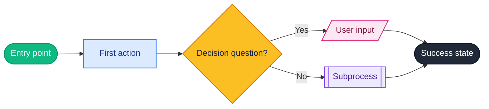

## User Input

```text
$ARGUMENTS
```

If user input names a specific story or flow, scope to that. Otherwise, generate the full flow across all P1/P2/P3 user stories in spec.md.

## Execution flow

### Step 1 — Read inputs
- `.specify/specs/[active]/spec.md` → user stories, JTBDs, acceptance scenarios
- `.specify/specs/[active]/plan.md` → per-story approach, state transitions

### Step 2 — Read the user-flow guide (required)
The full set of rules + shape standard + validation checklist lives in [`docs/USER-FLOW-GUIDE.md`](../../docs/USER-FLOW-GUIDE.md) — load it. **Every output MUST conform.** Violating a rule is a defect, not a stylistic choice.

**Platform rules (v0.3.8+, §0 of the guide) — non-negotiable:**
- **3:7 canvas layout** — test checklist on the LEFT (3 cols), flowchart canvas on the RIGHT (7 cols)
- **Legend with `?` popover** — pill-shaped legend in the top-right of the canvas, click opens a popover explaining every shape
- **Full-width container** — flow-doc grid spans the entire Tab 3 panel width
- **One flow per prototype** — express the WHOLE prototype as a single Mermaid flowchart. If exceeding 9 nodes even after subprocess extraction, **ASK the user** how to scope before drawing
- **`LR` direction always** — Start on the left, End(s) on the right
- **Color-coded shapes** via `classDef` (emerald / zinc / amber / blue / pink / purple — see guide §0.6 for the exact palette)
- **Straight-line connectors** — init Mermaid with `flowchart: { curve: 'linear' }`

**Craft constraints (the 18 rules, §3 of the guide):**
- Use ONLY the 6 standard shapes: stadium `([…])`, rectangle `[…]`, diamond `{…?}`, parallelogram `[/…/]`, subprocess `[[…]]`, cylinder `[(…)]`
- Single `Start` + at least one `End`. No dead-end branches (loops back to existing nodes are OK)
- Decision labels end with `?`. Every branch labeled `-- Yes -->` / `-- No -->`
- Sentence case in all labels. Verbs in actions. Questions in decisions
- 7±2 rule: 5-9 nodes per flow. Excess → extract `[[Subprocess]]`, then ASK if still over
- No emojis, no HTML, no Title Case, no ALL CAPS in labels

### Step 3 — Invoke supporting skills
- `craft-connect-flow` skill (from `./.claude/skills/craft-connect-flow/SKILL.md`) — for screen-to-screen navigation patterns, shared state, entry/exit points, deep links
- `design-generate-userflow` skill (if present in `./.claude/skills/`) — the canonical source of the 18 rules; identical to the in-repo guide

### Step 4 — Generate the Mermaid flowchart

Produce a fenced Mermaid block following the standard v0.3.8+ output format with the color-coded `classDef` block:

````markdown
**User flow: [actor] → [goal]**



**Summary:** [2-3 sentences: who the flow serves, main happy path, key decision points.]

**Assumptions:** [List assumptions if input was incomplete. Skip if none.]
````

The host template must initialize Mermaid with `{ flowchart: { curve: 'linear' } }` so connectors render as straight lines per platform rule §0.7.

For multi-actor flows, use `subgraph` swimlanes (max 3 lanes; if more, decompose). Even with swimlanes, the deliverable remains a single Mermaid block (platform rule §0.4).

### Step 5 — Validate against the 18 rules

Run the validation checklist from `USER-FLOW-GUIDE.md` §7. Each violation is a defect — fix before delivering. Examples:
- Exactly one `Start` node?
- All paths terminate at an `End` node?
- Every decision label ends with `?`?
- Every branch has `-- label -->`?
- Node count 5–9 (or subprocess for excess)?
- No Title Case / ALL CAPS in labels?
- Mermaid syntax valid (no unclosed brackets, no undefined nodes)?

### Step 6 — Generate the user-stories checklist
Below the Mermaid block, render a numbered list of one user story per flow path:

```markdown
1. **<Story title> (P1)** — <JTBD> [Story 1 in spec.md]
   - Path: <entry> → <action> → <action> → <outcome>
   - Test checklist:
     - [ ] <acceptance scenario 1>
     - [ ] <acceptance scenario 2>

2. **<Story title> (P2)** — <JTBD>
   ...
```

The checklist doubles as the **future testing checklist** (per Tab 3 guardrail #2 in [`03-data-flow.md`](../../docs/03-data-flow.md) §3.1).

### Step 7 — Write to Tab 3 of `template.html`

The Tab 3 layout is the v0.3.8+ **3:7 grid**: test checklist on the LEFT, flowchart canvas on the RIGHT. Update all four pieces:

1. **Set `PB_DATA.flow.populated = true`** to flip Tab 3 from empty state to populated view.
2. **Replace the body of `renderFlowPopulated()`** with the new `.flow-doc-grid` structure containing:
   - `<aside class="flow-doc-side">` — wrapping the test checklist (`.flow-doc-stories > li` per user story, with `.flow-doc-story-title` / `.flow-doc-story-path` / `.flow-doc-story-check`)
   - `<section class="flow-doc-main">` — header with title + actor/entry/goal sub + the legend pill button (`onclick="openLegendPopover(this)"`), `<div class="flow-doc-canvas">` containing the single `<div class="mermaid">…</div>`, then the summary + validation paragraphs
3. **Initialize Mermaid** in `renderMetaFlow()` with the linear-curve config:
   ```js
   mermaid.initialize({
     startOnLoad: false,
     theme: 'base',
     flowchart: { curve: 'linear', htmlLabels: true, padding: 16, useMaxWidth: true },
   });
   mermaid.run({ querySelector: '.flow-doc-canvas .mermaid' });
   ```
4. **Preserve all other tabs.** Tab 1 / 2 / 4 / 5 must remain untouched.

If `openLegendPopover` isn't yet defined in the template (pre-v0.3.8 install), inline the helper next to `recopyFromPopover`. See `assets/template.html` in the extension repo for the reference implementation.

## Confirm to user

```
✅ Tab 3 (User Flow) updated.
   Flow: N nodes, M edges (Mermaid `flowchart TD`)
   User stories: K stories (P1: a, P2: b, P3: c)
   Test checklist items: T
   Rules validation: all 18 passed

Drift check: skipped (Tab 3 is decoupled by design)
```

## Important rules

- **NEVER violate any of the 18 enforced rules** in [`USER-FLOW-GUIDE.md`](../../docs/USER-FLOW-GUIDE.md). Each violation is a defect to fix before delivery, not a stylistic option.
- **NEVER run drift check from /sync-flow** — Tab 3 is decoupled and trio principles don't constrain user-flow representation.
- **NEVER auto-trigger this from /build** or any other command. Only the user invokes /sync-flow.
- **NEVER omit the user-stories checklist** below the diagram — the checklist is what makes Tab 3 testable.
- **NEVER use external font files** in the diagram — Mermaid uses the page's font stack by default.
- **NEVER use emojis, HTML, Title Case, or ALL CAPS** in node labels.
- **NEVER mix flow directions** — pick TD or LR per flow and stick to it.
