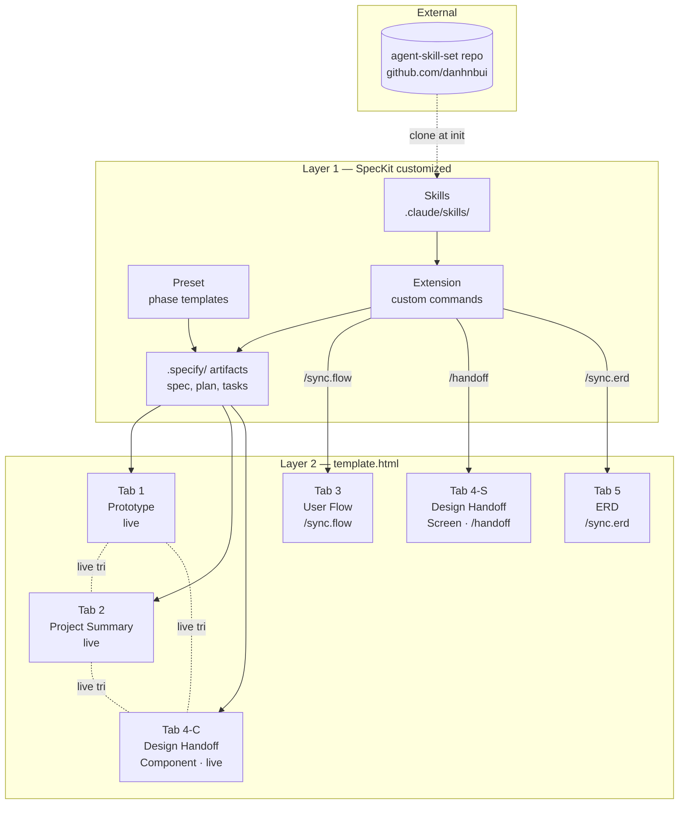

# 02 — Architecture

**Purpose**: Show the system shape — what layers exist, what each layer owns, where every file lives, and how the pieces wire together.

For the visual: see the inline Visualizer SVG rendered in the chat where this package was generated, or re-generate from the Mermaid diagram in section 8 below.

---

## 1. System overview

The system has **2 layers**. Earlier outline drafts proposed 3 — Danh correctly pointed out that SpecKit's Preset + Extension system IS what was being called the "wrapper layer." So:

| Layer | What it is | What it owns |
|-------|-----------|-------------|
| **Layer 1 — SpecKit (customized)** | The workflow engine | Preset, Extension, cloned skills, all `.specify/` outputs, drift logic |
| **Layer 2 — `template.html`** | The deliverable | The 5-tab single-file prototype, rendered visualization |

Layer 1 writes into Layer 2. Layer 2 reads from `.specify/` markdown artifacts. The arrow is one-way.

### What Layer 1 does NOT own
- The browser-rendered output of `template.html` (that's the browser's job)
- The design system source files (they're pulled to `./design-system/` and treated as read-only)
- The skill source code (it lives in the external repo)

### What Layer 2 does NOT own
- Any business logic for drift detection or HITL gates
- Any direct read of the external skill repo
- Any state across browser refreshes (single-file, stateless)

---

## 2. Folder structure (per-prototype repo)

```
my-prototype/
├── .specify/                              ← SpecKit workflow files
│   ├── memory/
│   │   └── constitution.md                ← prototype principles + stack lock
│   ├── specs/
│   │   └── 001-feature-name/
│   │       ├── spec.md                    ← from /speckit.specify
│   │       ├── clarify.md                 ← from /speckit.clarify
│   │       ├── plan.md                    ← from /speckit.plan
│   │       ├── tasks.md                   ← from /speckit.tasks
│   │       └── checklist.md               ← from /speckit.checklist
│   ├── templates/                         ← Preset overrides
│   │   └── commands/
│   │       ├── constitution.md
│   │       ├── specify.md
│   │       ├── clarify.md
│   │       ├── plan.md
│   │       └── tasks.md
│   ├── extensions/                        ← custom commands
│   │   └── commands/
│   │       ├── build.md
│   │       ├── sync.flow.md
│   │       ├── sync.erd.md
│   │       ├── handoff.md
│   │       ├── skills.refresh.md
│   │       └── check.drift.md
│   ├── presets.yml                        ← Preset manifest
│   └── extensions.yml                     ← Extension manifest
├── .claude/
│   └── skills/                            ← cloned from agent-skill-set
│       ├── think-layout/
│       ├── think-logic/
│       ├── think-critique-prd/
│       ├── think-clarify/
│       ├── ref-blueprint/
│       ├── ref-prd/
│       ├── design-component-build/
│       ├── design-critics/
│       ├── craft-connect-flow/
│       ├── craft-research/
│       └── agent-orchestrate-tasks/
├── design-system/                         ← pulled at setup, locked
│   ├── tokens.json
│   ├── components/
│   └── README.md
├── prototype/
│   └── template.html                      ← the deliverable (5 tabs)
├── docs/                                  ← this handoff package, copied in
│   ├── HANDOFF.md
│   ├── 01-srs.md
│   ├── 02-architecture.md
│   ├── 03-data-flow.md
│   ├── 04-orchestrator.md
│   └── 05-execution-plan.md
├── PROTOTYPE-BUILDER.md                   ← Danh's original guide
└── README.md                              ← human-facing intro
```

---

## 3. File-role table

Every file that matters, what it does, who writes it, who reads it.

| File | Role | Written by | Read by |
|------|------|------------|---------|
| `.specify/memory/constitution.md` | Project principles, stack lock, DS lock | `/speckit.constitution` | Drift check every trio prompt |
| `.specify/specs/*/spec.md` | Feature spec | `/speckit.specify` | `/build`, drift check, Tab 2 writer |
| `.specify/specs/*/clarify.md` | Clarifications log | `/speckit.clarify` | Tab 2 writer (UI Logic Trade-offs section) |
| `.specify/specs/*/plan.md` | Tech plan | `/speckit.plan` | `/build`, Tab 4-Component writer |
| `.specify/specs/*/tasks.md` | Task list | `/speckit.tasks` | `/build`, Phase 5 executor |
| `.specify/specs/*/checklist.md` | Pre-build quality gate | `/speckit.checklist` | Danh (review), `/build` (refuses if checklist incomplete) |
| `.specify/templates/commands/*.md` | Preset phase templates | Phase 1 of execution plan | SpecKit core when running `/speckit.*` |
| `.specify/extensions/commands/*.md` | Extension command definitions | Phase 2 of execution plan | SpecKit core when running custom `/*` |
| `.specify/presets.yml` | Preset metadata | Phase 1 task 1.1 | `specify preset add` |
| `.specify/extensions.yml` | Extension metadata + hooks | Phase 2 task 2.1 | SpecKit core, drift check hook |
| `.claude/skills/*/SKILL.md` | Individual skill | External repo | Claude Code when invoking skill |
| `design-system/tokens.json` | DS tokens | Pulled at setup | Tab 1 build, Tab 4-Component, Tab 4-Screen right panel |
| `prototype/template.html` | The 5-tab deliverable | `/build`, `/sync.flow`, `/sync.erd`, `/handoff` | Browser, Danh, testers |
| `docs/*.md` | This handoff package | Claude (chat) | Claude Code (executor) |

---

## 4. SpecKit Preset structure

A SpecKit Preset overrides default phase templates without forking SpecKit.

```
.specify/
├── presets.yml                            ← manifest
│   contains:
│     name: prototype-builder
│     version: 1.0.0
│     priority: 100
│     templates:
│       constitution: templates/commands/constitution.md
│       specify:      templates/commands/specify.md
│       clarify:      templates/commands/clarify.md
│       plan:         templates/commands/plan.md
│       tasks:        templates/commands/tasks.md
└── templates/commands/
    ├── constitution.md     ← writes Tab 2 Principles + stack lock
    ├── specify.md          ← writes Tab 2 Overview > Objectives
    ├── clarify.md          ← writes Tab 2 Overview + UI Logic Trade-offs
    ├── plan.md             ← writes a tab+skill plan (which tabs + which skills)
    └── tasks.md            ← writes per-tab actionable tasks
```

Each `templates/commands/*.md` is a markdown file with YAML frontmatter defining the command's behavior, plus a body that tells the AI agent what to do during that phase.

---

## 5. SpecKit Extension structure

A SpecKit Extension adds new slash commands that don't exist in core.

```
.specify/
├── extensions.yml                         ← manifest
│   contains:
│     name: prototype-builder-ext
│     version: 1.0.0
│     commands:
│       - build
│       - sync.flow
│       - sync.erd
│       - handoff
│       - skills.refresh
│       - check.drift
│     hooks:
│       before_build: check_drift_trio
│       before_handoff: check_drift_trio
│       after_skills.refresh: validate_skill_set
└── extensions/commands/
    ├── build.md           ← generate or update Tab 1
    ├── sync.flow.md       ← generate Tab 3 (SVG + user stories)
    ├── sync.erd.md        ← generate Tab 5 (Mermaid ERD)
    ├── handoff.md         ← generate Tab 4 Screen view
    ├── skills.refresh.md  ← re-pull pinned skill repo
    └── check.drift.md     ← manual drift audit
```

The `hooks` section in `extensions.yml` is critical — it's how the drift check inserts itself before any trio-touching command.

---

## 6. Skill repo integration

### Clone strategy

```
specify init --preset prototype-builder
    │
    ├─ Reads presets.yml → finds skill_source URL + pinned tag
    │
    ├─ git clone --depth 1 --branch v0.1.0 \
    │     https://github.com/danhnbui/agent-skill-set.git \
    │     ./.claude/skills
    │
    └─ Verifies presence of required skills (listed in 04-orchestrator.md)
       If any missing → hard fail with the missing list
```

### `/skills.refresh` mechanics

When Danh runs `/skills.refresh`:

1. Reads the current pinned tag from `.specify/memory/constitution.md`
2. Runs `git fetch --tags` in `./.claude/skills/`
3. Lists available tags newer than pinned
4. Prompts Danh: `"Pin to <new tag>? (yes / no / specific tag)"`
5. On approval: `git checkout <tag>` and update constitution.md

This is opt-in. Danh decides when to upgrade.

### Required skills

The Preset declares a minimum set of skills that MUST exist in the cloned repo. If any is missing, init hard-fails. Full list in `04-orchestrator.md` section "Skill firing matrix."

---

## 7. template.html structure

The 5-tab shell stays as designed in PROTOTYPE-BUILDER.md. Three additions wire it to SpecKit:

### Addition A — SpecKit-output hooks

Each tab's content function reads from `.specify/` markdown artifacts. Pseudocode for the runtime side:

```javascript
function renderTab2() {
  const constitution = readFile('.specify/memory/constitution.md');
  const spec = readFile('.specify/specs/<current>/spec.md');
  const clarify = readFile('.specify/specs/<current>/clarify.md');

  return {
    overview: parseSection(spec, 'Objectives'),
    principles: parseSection(constitution, 'Principles'),
    userInsights: parseSection(clarify, 'User Insights') ?? '<empty>',
    uiLogicTradeoffs: parseSection(clarify, 'UI Logic Trade-offs') ?? '<empty>',
  };
}
```

Because `template.html` is a single static HTML file, this reading happens at build time (when `/build` is run), not at browser runtime. Claude Code generates the populated HTML string.

### Addition B — Tab 4 dual-view internals

Two view modes inside Tab 4:

```
Tab 4 (Design Handoff)
├── View toggle: [Component] [Screen]
├── Component view (default, auto-sync)
│   └── For each custom organism:
│       ├── Variant chips (toggle)
│       └── Live preview
└── Screen view (manual, /handoff)
    ├── Screen dropdown
    └── 7:3 layout
        ├── Left (7): screen render + annotations + logic notes
        └── Right (3): selected element spec (tokens + sizing only)
```

The 7:3 split uses CSS grid: `grid-template-columns: 7fr 3fr`. Clicking an element on the left updates the right via a data attribute lookup against the same DS tokens used in Component view.

### Addition C — Tab 2 sub-sections

Tab 2 (Project Summary) gains explicit sub-section headers:

```
1. Overview
   ├── Objectives        ← from spec.md
   └── Principles        ← from constitution.md

2. User Insights
   ├── Quantitative Data
   ├── Research Summary Report
   └── Executive Summary

3. UI Logic Trade-offs   ← from clarify.md

4. Others                ← reserved per-project
```

Empty sub-sections render with an empty-state message: `"No <section> recorded yet."`

---

## 8. System shape diagram (Mermaid)

A Claude Code–readable version of the architecture diagram shown in chat:



---

## 9. What changes if Danh later needs multi-prototype

Out of scope today, but the migration path:

1. Move `.specify/templates/` and `.specify/extensions/` to a shared location
2. Each prototype repo becomes a thin shell that references the shared Preset
3. The `.claude/skills/` clone moves to a system-level directory shared across prototypes
4. Drift detection scope expands from one repo to one project

Not blocking v1.0. Documented here so the future migration isn't a surprise.
