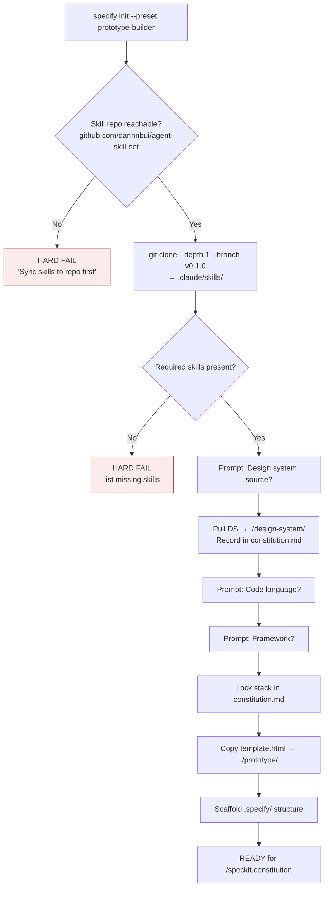
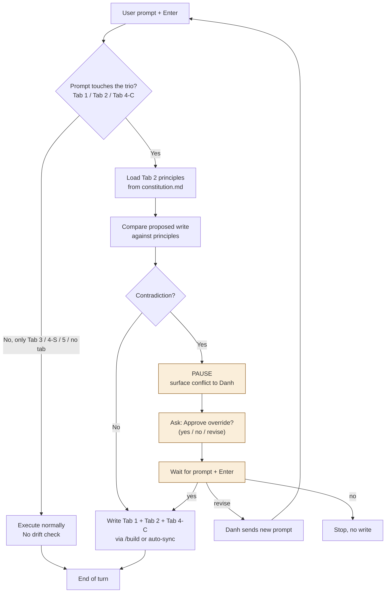
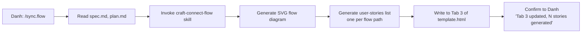
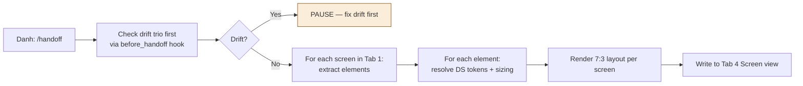
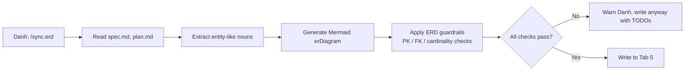
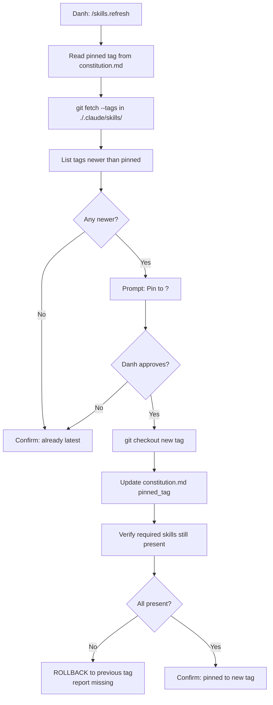
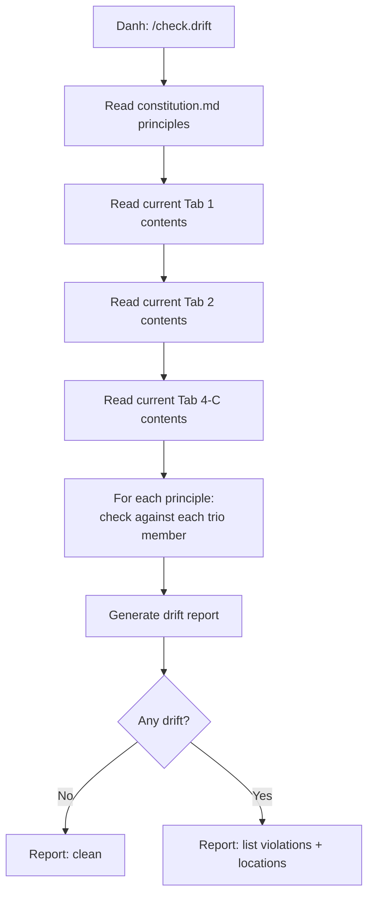
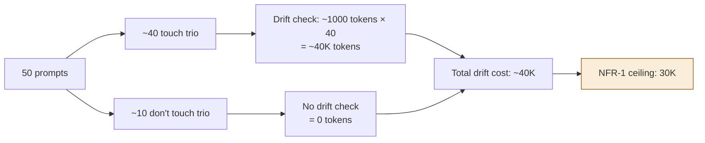

# 03 — Data Flow

**Purpose**: Show how data moves through the system at three levels — init, per-prompt, and manual sync. Diagrams are Mermaid (Claude Code can render or read them as text).

---

## 1. Init flow (one-time per prototype)

When Danh runs `specify init --preset prototype-builder` in a fresh directory:

### What gets created at init

| Path | Contents |
|------|----------|
| `./.claude/skills/` | Cloned skills, pinned tag |
| `./design-system/` | DS tokens + components |
| `./prototype/template.html` | Empty 5-tab scaffold |
| `./.specify/` | SpecKit standard structure |
| `./.specify/memory/constitution.md` | Includes stack lock + DS lock |
| `./.specify/presets.yml` | Preset metadata |
| `./.specify/extensions.yml` | Extension manifest + drift hooks |

---

## 2. Per-prompt flow (the main hot path)

Every time Danh sends a prompt and hits Enter:

### Trio-touching detection

The trio-touching check is a lightweight regex/keyword scan over the prompt:

| Triggers trio check | Examples |
|--------------------|----------|
| Mentions Tab 1 concepts | "the prototype", "the screen", "the UI", "user can click" |
| Mentions Tab 2 concepts | "the objective", "the principle", "the rule" |
| Mentions Tab 4-C concepts | "this component", "the card", "the button", a known organism name |

If none match → drift check skipped. Saves ~60% of drift-check token cost.

### Drift check internals

The drift check is Option A — AI self-check. Specifically:

1. Read `.specify/memory/constitution.md` (cached after first read this session)
2. Extract the Principles section
3. For each principle, ask: "Does the proposed write contradict this?"
4. If any answer is yes → PAUSE
5. Token cost: ~700–1,500 per check (varies with principle count)

---

## 3. Manual sync flows (Tab 3, Tab 4-Screen, Tab 5)

These never auto-trigger. Danh runs the command explicitly.

### 3.1 `/sync.flow` — Tab 3 (User Flow)

User-stories generated alongside the flow act as the future test checklist (per Tab 3 guardrail #2).

### 3.2 `/handoff` — Tab 4 Screen view

The right panel only emits **spec tokens + sizing** — never code. Code stays in Tab 1.

### 3.3 `/sync.erd` — Tab 5

---

## 4. Skill refresh flow

Rollback on missing skills protects against breaking changes in the external repo.

---

## 5. Drift audit flow (manual)

When Danh runs `/check.drift`:

This is the "did anything slip past the per-prompt check?" audit. Run after marathon sessions.

---

## 6. Token-cost data flow

A 50-turn session, scoped drift check:

Note: the 40K estimate slightly exceeds NFR-1's 30K target. Mitigations:

| Mitigation | Savings |
|-----------|---------|
| Cache parsed principles in session | ~30% |
| Shorter principles (≤3 lines each) | ~20% |
| Skip drift check if last 3 turns were clean | ~25% |

These are post-Phase-7 optimizations. v1.0 ships with raw Option A.

---

## 7. Data dependencies summary

Compact view of what reads from what:

| Reader | Source(s) |
|--------|-----------|
| Drift check | `constitution.md` |
| Tab 1 (`/build`) | `spec.md`, `plan.md`, `tasks.md`, `design-system/` |
| Tab 2 overview | `spec.md` (Objectives), `constitution.md` (Principles) |
| Tab 2 user insights | `clarify.md`, external research artifacts (Danh-provided) |
| Tab 2 UI logic | `clarify.md` |
| Tab 3 (`/sync.flow`) | `spec.md`, `plan.md`, `craft-connect-flow` skill |
| Tab 4-Component | `plan.md`, `design-system/`, `design-component-build` skill |
| Tab 4-Screen (`/handoff`) | Tab 1 HTML, `design-system/`, `design-critics` skill |
| Tab 5 (`/sync.erd`) | `spec.md`, `plan.md`, ERD guardrails (this doc) |
| `/skills.refresh` | external repo only |
| `/check.drift` | `constitution.md`, current `template.html` |
