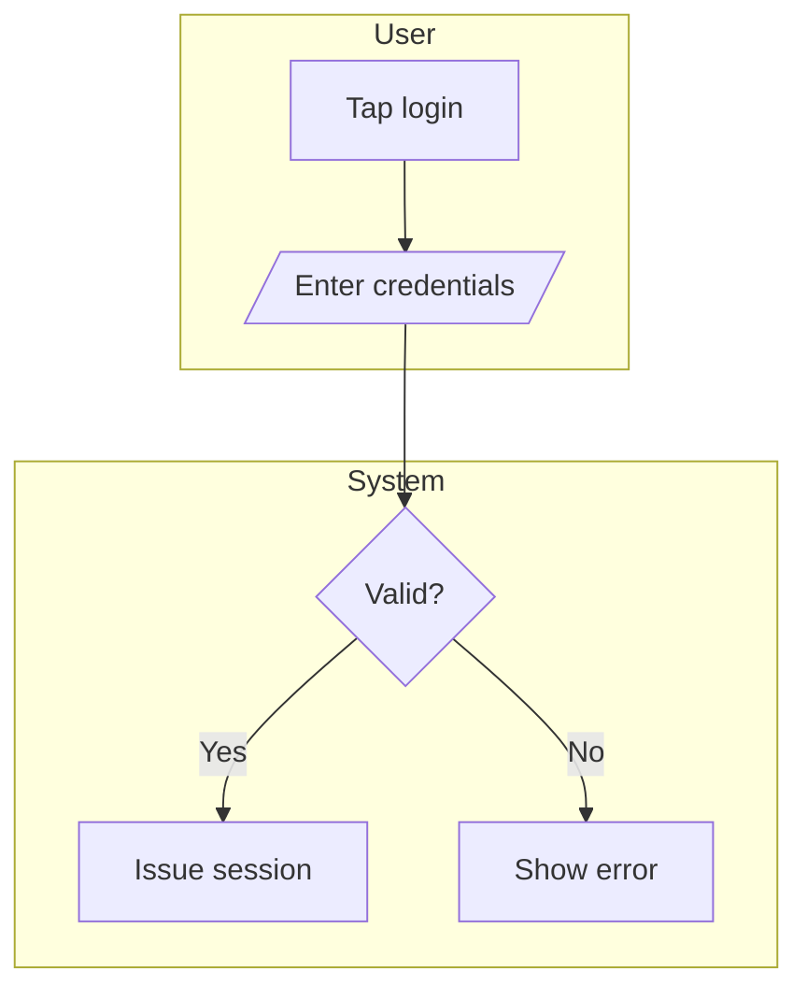

# User Flow Guide

A compact reference for authoring user-flow diagrams in the Prototype Builder's Tab 3 (User Flow). Distilled from the `design-generate-userflow` skill (full source: skill repo or `~/Downloads/design-generate-userflow-SKILL.md`).

Output format: **Mermaid `flowchart`** in a fenced markdown block + a 2-3 sentence narrative summary. Rendered inline in Tab 3 of `template.html`.

---

## 1 · The 6 shapes (use only these)

| Element | Shape | Mermaid | Use for |
|---|---|---|---|
| Start / End | Stadium | `([text])` | Entry / exit points |
| Screen / Action | Rectangle | `[text]` | A screen, page, or user action |
| Decision | Diamond | `{text?}` | A branching question |
| Input / Output | Parallelogram | `[/text/]` | Data entering or leaving |
| Subprocess | Stadium-bordered | `[[text]]` | Reusable sub-flow |
| External system | Cylinder | `[(text)]` | Database, API, third party |

Direction: `flowchart TD` (top-down) by default. Switch to `LR` only when the flow has >8 nodes or wide branching.

---

## 2 · Required inputs (STOP if missing)

Before generating, confirm these 3:

1. **Actor** — who performs the flow (e.g. "anonymous visitor", "logged-in buyer")
2. **Entry point** — where the flow starts (e.g. "homepage", "email link tap")
3. **Goal** — what success looks like (e.g. "submit a listing", "verify phone")

If any is missing AND cannot be reasonably inferred → ask the user before drawing.

---

## 3 · The 18 enforced rules

### Layout
1. **One direction** per flow (TD or LR, never mixed).
2. **Single Start** node. Multiple entries → multiple flows.
3. **Every path ends** at an `End([…])`. No dead-end branches.

### Decisions
4. **One question per diamond.** "Logged in AND paid?" → two diamonds.
5. **Label every branch.** `-- Yes -->`, `-- No -->`. Never leave unlabeled.
6. **Binary first.** Yes/No default. Multi-way only for mutually exclusive states (e.g. user role).

### Connections
7. **No orphan nodes.** Every node has ≥1 incoming (except Start) + 1 outgoing (except End).
8. **No crossing logic.** Intersections → refactor with a merge node.
9. **No bidirectional arrows.** Loops use two separate arrows with labels.

### Complexity
10. **7±2 rule.** Aim for 5–9 nodes per flow. Excess → extract a `[[Subprocess]]`.
11. **One purpose per flow.** If the title needs "and", split into two flows.

### Semantics
12. **Verbs in actions.** "Validate input" not "Input validation".
13. **Questions in decisions.** End decision labels with `?`. "Logged in?" not "Login status".
14. **Sentence case.** Not Title Case, not ALL CAPS.
15. **Be specific.** "Charge card via Stripe" > "Process payment" when the system is known.

### Style
16. **No emojis in node labels** (renders inconsistently across viewers).
17. **No HTML in node labels.** Plain text only.
18. **Quote special characters.** Labels with `(`, `)`, `/`, `?`, `:` use `["label with chars"]`.

---

## 4 · Standard output structure

````markdown
**User flow: [actor] → [goal]**


**Summary:** [2-3 sentences: who the flow serves, main happy path, key decision points.]

**Assumptions:** [List assumptions if input was incomplete. Skip if none.]
````

No extra prose. No emojis. No other diagram notations alongside.

---

## 5 · Connectors

| Connector | Mermaid | Meaning |
|---|---|---|
| Solid arrow | `-->` | Standard sequence |
| Labeled arrow | `-- label -->` | Decision branch / conditional |
| Dotted arrow | `-.->` | Optional / async / system-triggered |
| Thick arrow | `==>` | Happy-path emphasis (max once per flow) |

---

## 6 · Swimlanes (for multi-actor flows)



- One subgraph per distinct actor or boundary
- Cross-lane edges allowed and expected
- **Max 3 lanes per flow** — more = too complex, decompose

---

## 7 · Validation checklist (before delivery)

- [ ] Exactly one `Start` node
- [ ] At least one `End` node; all paths terminate
- [ ] Every decision label ends with `?`
- [ ] Every decision branch has `-- label -->`
- [ ] No Title Case, no ALL CAPS
- [ ] Every action uses verb-first phrasing
- [ ] Node count 5–9, OR a `[[Subprocess]]` for excess
- [ ] Direction consistent (all TD or all LR)
- [ ] Mermaid syntax valid (no unclosed brackets, no undefined nodes)
- [ ] Narrative is 2-3 sentences, not a node-by-node recap
- [ ] Assumptions block present if input was incomplete

Any unchecked → fix before delivering.

---

## 8 · Edge cases

- **Loops** — label the loop-back arrow: `I -- No --> H`. Never unlabeled.
- **Parallel** — Mermaid has no native fork/join. Use `A --> B & C` to fan out, `B & C --> D` to merge. Add a narrative note.
- **Errors** — Critical → own `End([Error: reason])`. Recoverable → loop back. Silent (logging) → omit unless requested.
- **Anonymous vs auth** — Shared steps → single decision diamond + merge. Diverged → two separate flows.
- **Cross-platform** — Identical → one diagram, note "applies to both". Different → two diagrams. Mostly identical → annotated diverging branches (e.g. `-- iOS only -->`).
- **Revisions** — Parse existing → apply change → re-validate → narrative notes what changed. Output revised only, not old.

---

## 9 · What this skill does NOT handle

| Request | Use instead |
|---|---|
| Journey map (emotions + phases) | Separate journey-map skill |
| Service blueprint (frontstage + backstage) | Separate blueprint skill |
| Sitemap / IA (hierarchical) | Sitemap skill |
| Wireframe (visual fidelity) | Design tool, not Mermaid |
| BPMN | BPMN tool, not Mermaid |
| State machine | State diagram skill |

When unsure which artifact the user wants, ask before drawing.

---

## Related

- `/speckit-prototype-builder-sync-flow` — invokes this skill against the current spec to populate Tab 3
- `craft-connect-flow` skill — screen-to-screen navigation patterns (different from branching logic)
- `think-logic` skill — internal rule detail within a flow node
- ANSI/ISO 5807:1985 — shape conventions origin

---

## Changelog

- **v1.0** — Skill ingested into Prototype Builder docs (2026-05-17). Originated as `design-generate-userflow-SKILL.md` from PropertyGuru / Batdongsan practice. 18 enforced rules; Mermaid-only output.
