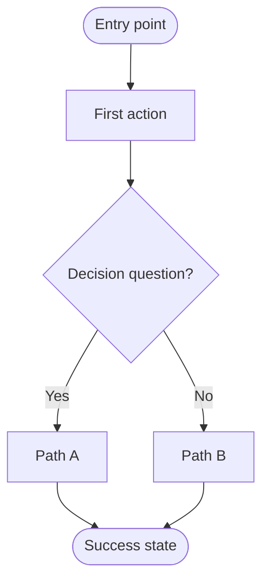
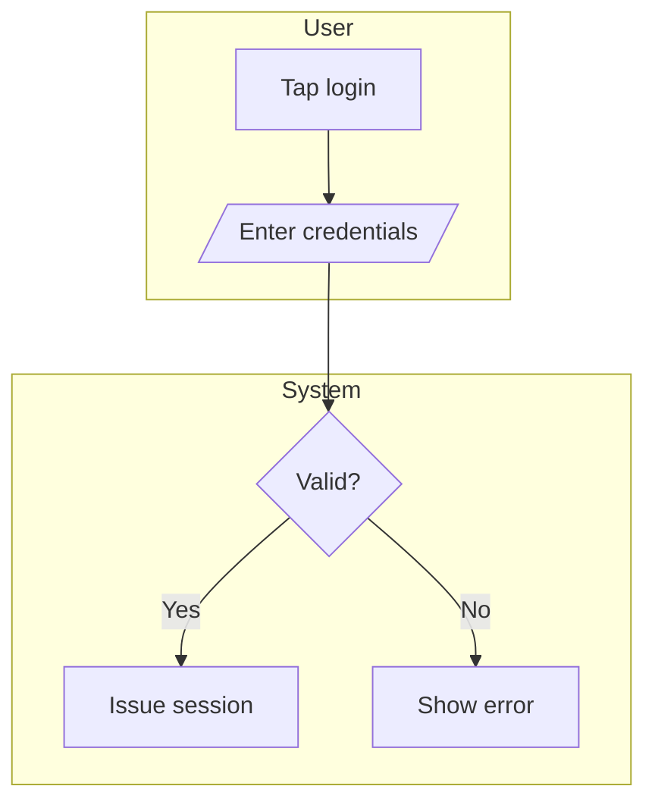

# User Flow Guide

A compact reference for authoring user-flow diagrams in the Prototype Builder's Tab 3 (User Flow). Distilled from the `design-generate-userflow` skill (full source: skill repo or `~/Downloads/design-generate-userflow-SKILL.md`).

Output format: **Mermaid `flowchart`** in a fenced markdown block + a 2-3 sentence narrative summary. Rendered inline in Tab 3 of `template.html`.

---

## 0 · Platform rules (v0.3.14+) — non-negotiable

These 7 rules govern how `/speckit-prototype-builder-sync-flow` populates Tab 3. They sit on top of the 18 craft rules in §3 and override anything that conflicts.

1. **3:7 canvas layout.** Render the test checklist on the LEFT (3 columns) and the flowchart canvas on the RIGHT (7 columns). Stack on viewports <980 px.
2. **Legend with `?` popover.** Show a pill-shaped legend in the top-right of the canvas (shape swatches + the word "Legend" + a `?` icon). Clicking it opens an anchored popover that explains every shape and connector style.
3. **Full-width container.** The flow-doc grid spans the entire Tab 3 panel width (no `max-width` clamp) — title and canvas align.
4. **One combined flow by default, multiple only when truly necessary.** Express the WHOLE prototype as a single Mermaid flowchart that covers every user story (including edge cases) — push the per-story detail into `[[Subprocess]]` nodes. The combined flow goes into one `<div class="flow-doc-section">` inside `#flow-stage`; the test checklist on the left maps each story to a path. Only stack multiple sections when the flows are truly independent (different actors AND different goals) or when a single combined flow would exceed 9 nodes even after subprocess extraction. **ASK the user** when unsure. The `.flow-canvas` / `.flow-viewport` / `.flow-stage` trio still gives pan + zoom + fit-to-view (`+` / `−` / `⊙` controls in the top-right) for any flow count.
5. **`LR` direction.** Use `flowchart LR` always. Start sits on the left, End(s) on the right.
6. **Color-coded shapes (v0.3.9 palette) + 24px corners on rectangles (v0.3.12).** Apply this `classDef` palette so users can scan node types at a glance:
   - Start → `fill:#0f172a,stroke:#000000,color:#ffffff` (zinc-900 pill)
   - End → `fill:#0f172a,stroke:#000000,color:#ffffff` (zinc-900 pill — same as Start, distinguished by position)
   - Action → `fill:#F3E8FF,stroke:#C084FC,color:#581c87` (lavender) **+ rx=24**
   - Decision → `fill:#DBEAFE,stroke:#60A5FA,color:#1e3a8a` (sky)
   - Input / Output → `fill:#FCE7F3,stroke:#EC4899,color:#831843` (pink)
   - Subprocess → `fill:#EDE9FE,stroke:#7C3AED,color:#4c1d95,stroke-width:2px` (purple) **+ rx=24**

   **Subprocess syntax**: use `R(Subprocess label)` (rounded-rect shape), not `R[[Subprocess label]]` (stadium-bordered polygon) — only the rect form accepts the 24px corner radius. Post-render JS in the host template sets `rx="24"` on each `.node.cAction > rect` and `.node.cSubprocess > rect` because Mermaid's `classDef rx/ry` isn't honored on rectangles in the current renderer.
7. **Orthogonal connectors (horizontal/vertical only).** Initialize Mermaid with `flowchart: { curve: 'step', useMaxWidth: false }` so every edge segment is either purely horizontal or purely vertical with right-angle bends. No diagonals, no smooth curves — reads cleanest on a stacked canvas and matches the whiteboard-flowchart convention.

8. **Wireflow nodes (v0.3.14+).** Every screen-shaped node in the flow MUST be labeled with the **exact same screen name** used in `PB_DATA.handoff.screens[N].name` (Tab 4). This binds the flow to the handoff so reviewers can request edits by screen name without ambiguity. Populate two registries so the template wires up click-to-preview + numbered note badges:
   ```js
   const WIREFLOW_SCREENS = {
     S: { fn: 'renderSignInScreen',         label: 'Sign in Page' },
     R: { fn: 'renderRegisterScreen',       label: 'Register Page' },
     // … one entry per screen-mapped Mermaid node id
   };
   const WIREFLOW_NOTES = { 1: 'F', 2: 'O', 3: 'O', /* note# → node id */ };
   ```
   The sidebar gets a "Flow notes" section (`<ol class="flow-doc-notes">`) where each `<li>` opens with `<span class="flow-doc-note-num">N</span>` matching the badge `N` on the corresponding node. Notes carry business-logic detail that doesn't fit in an edge label (rate limits, expiry windows, lockout copy, etc.).

---

## 1 · The 6 shapes (use only these)

| Element | Shape | Mermaid | Use for |
|---|---|---|---|
| Start / End | Stadium | `([text])` | Entry / exit points |
| Screen / Action | Rectangle | `[text]` | A screen, page, or user action |
| Decision | Diamond | `{text?}` | A branching question |
| Input / Output | Parallelogram | `[/text/]` | Data entering or leaving |
| Subprocess | Stadium-bordered | `[[text]]` | Reusable sub-flow — detail lives in the test checklist |
| External system | Cylinder | `[(text)]` | Database, API, third party |

Direction: `flowchart LR` (per platform rule §0.5). The legacy `TD` default is retired.

---

## 2 · Required inputs (STOP if missing)

Before generating, confirm these 3:

1. **Actor** — who performs the flow (e.g. "anonymous visitor", "logged-in buyer")
2. **Entry point** — where the flow starts (e.g. "homepage", "email link tap")
3. **Goal** — what success looks like (e.g. "submit a listing", "verify phone")

If any is missing AND cannot be reasonably inferred → ask the user before drawing.

---

## 3 · The 18 enforced rules

### Layout
1. **One direction** per flow — **`LR` by platform rule §0.5**, never mixed.
2. **Single Start** node. Multiple entries → multiple flows.
3. **Every path ends** at an `End([…])` or loops back to an existing node. No dead-end branches.

### Decisions
4. **One question per diamond.** "Logged in AND paid?" → two diamonds.
5. **Label every branch.** `-- Yes -->`, `-- No -->`. Never leave unlabeled.
6. **Binary first.** Yes/No default. Multi-way only for mutually exclusive states (e.g. user role).

### Connections
7. **No orphan nodes.** Every node has ≥1 incoming (except Start) + 1 outgoing (except End).
8. **No crossing logic.** Intersections → refactor with a merge node.
9. **No bidirectional arrows.** Loops use two separate arrows with labels.

### Complexity
10. **7±2 rule.** Aim for 5–9 nodes per **individual flow**. Excess → extract a `[[Subprocess]]`. If you still exceed 9 after extraction, **ASK the user** how to scope that flow before drawing.
11. **One purpose per flow.** If a flow's title needs "and", split it into two flows — both still ship inside the zoomable canvas per platform rule §0.4.

### Semantics
12. **Verbs in actions.** "Validate input" not "Input validation".
13. **Questions in decisions.** End decision labels with `?`. "Logged in?" not "Login status".
14. **Sentence case.** Not Title Case, not ALL CAPS.
15. **Be specific.** "Charge card via Stripe" > "Process payment" when the system is known.

### Style
16. **No emojis in node labels** (renders inconsistently across viewers).
17. **No HTML in node labels.** Plain text only.
18. **Quote special characters.** Labels with `(`, `)`, `/`, `?`, `:` use `["label with chars"]`.

---

## 4 · Standard output structure

````markdown
**User flow: [actor] → [goal]**



**Summary:** [2-3 sentences: who the flow serves, main happy path, key decision points.]

**Assumptions:** [List assumptions if input was incomplete. Skip if none.]
````

No extra prose. No emojis. No other diagram notations alongside.

---

## 5 · Connectors

| Connector | Mermaid | Meaning |
|---|---|---|
| Solid arrow | `-->` | Standard sequence |
| Labeled arrow | `-- label -->` | Decision branch / conditional |
| Dotted arrow | `-.->` | Optional / async / system-triggered |
| Thick arrow | `==>` | Happy-path emphasis (max once per flow) |

---

## 6 · Swimlanes (for multi-actor flows)



- One subgraph per distinct actor or boundary
- Cross-lane edges allowed and expected
- **Max 3 lanes per flow** — more = too complex, decompose

---

## 7 · Validation checklist (before delivery)

- [ ] Exactly one `Start` node
- [ ] At least one `End` node; all paths terminate
- [ ] Every decision label ends with `?`
- [ ] Every decision branch has `-- label -->`
- [ ] No Title Case, no ALL CAPS
- [ ] Every action uses verb-first phrasing
- [ ] Node count 5–9, OR a `[[Subprocess]]` for excess
- [ ] Direction consistent (all TD or all LR)
- [ ] Mermaid syntax valid (no unclosed brackets, no undefined nodes)
- [ ] Narrative is 2-3 sentences, not a node-by-node recap
- [ ] Assumptions block present if input was incomplete

Any unchecked → fix before delivering.

---

## 8 · Edge cases

- **Loops** — label the loop-back arrow: `I -- No --> H`. Never unlabeled.
- **Parallel** — Mermaid has no native fork/join. Use `A --> B & C` to fan out, `B & C --> D` to merge. Add a narrative note.
- **Errors** — Critical → own `End([Error: reason])`. Recoverable → loop back. Silent (logging) → omit unless requested.
- **Anonymous vs auth** — Shared steps → single decision diamond + merge. Diverged → two separate flows.
- **Cross-platform** — Identical → one diagram, note "applies to both". Different → two diagrams. Mostly identical → annotated diverging branches (e.g. `-- iOS only -->`).
- **Revisions** — Parse existing → apply change → re-validate → narrative notes what changed. Output revised only, not old.

---

## 9 · What this skill does NOT handle

| Request | Use instead |
|---|---|
| Journey map (emotions + phases) | Separate journey-map skill |
| Service blueprint (frontstage + backstage) | Separate blueprint skill |
| Sitemap / IA (hierarchical) | Sitemap skill |
| Wireframe (visual fidelity) | Design tool, not Mermaid |
| BPMN | BPMN tool, not Mermaid |
| State machine | State diagram skill |

When unsure which artifact the user wants, ask before drawing.

---

## Related

- `/speckit-prototype-builder-sync-flow` — invokes this skill against the current spec to populate Tab 3
- `craft-connect-flow` skill — screen-to-screen navigation patterns (different from branching logic)
- `think-logic` skill — internal rule detail within a flow node
- ANSI/ISO 5807:1985 — shape conventions origin

---

## Changelog

- **v1.0** — Skill ingested into Prototype Builder docs (2026-05-17). Originated as `design-generate-userflow-SKILL.md` from PropertyGuru / Batdongsan practice. 18 enforced rules; Mermaid-only output.
