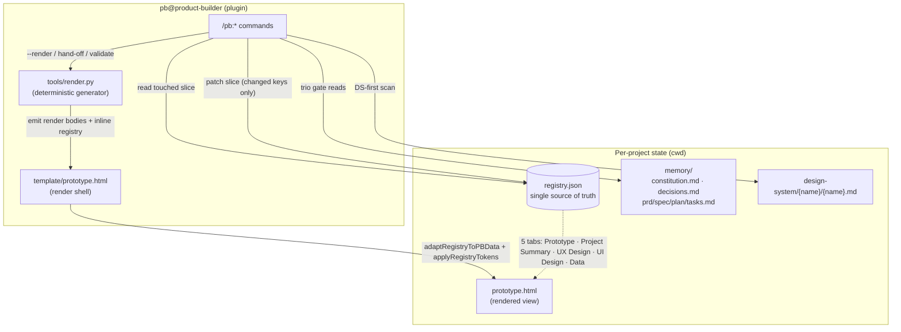

# Architecture — Product Builder v1.3.0

The standalone, CLAUDE.md-native architecture. Read the [router](../CLAUDE.md) first; the
data contract lives in the [playbook](../prototype-builder.md). This doc covers the plugin
layout, `registry.json` as source of truth, the generator + adapter, the memory layer, the
5 tabs, and the command surface.

## What it is

Product Builder is a standalone **Claude Code plugin** (`pb@product-builder`). **No SpecKit** —
no `extension.yml`, no `preset.yml`, no `after_*` hooks. State lives in `registry.json`;
behavior lives in 12 native `/pb:*` commands; the view is a deterministically rendered
`prototype.html`. The core is **design-system-agnostic** — no hardcoded design system, icon
CDN, or token outside per-project config.

## Plugin layout

The plugin ships under `./pb/`, registered through the repo-root marketplace.

```
prototype-builder v.2/
├─ .claude-plugin/
│  └─ marketplace.json          # marketplace "product-builder" → plugin pb (source ./pb)
├─ pb/                          # the plugin
│  ├─ .claude-plugin/
│  │  └─ plugin.json            # name "pb", version 1.2.0
│  ├─ commands/                 # the 12 /pb:* command bodies (*.md)
│  ├─ tools/
│  │  └─ render.py              # deterministic registry.json → prototype.html generator
│  └─ template/                 # seeds copied into each project at /pb:init
│     ├─ prototype.html         # the render shell (ported v0.4.0 machinery + adapter)
│     ├─ registry.template.json
│     ├─ constitution.template.md
│     ├─ decisions.template.md
│     ├─ design-system.template.md
│     ├─ figma-tokens.template.json
│     └─ figma-transfer.template.json
├─ CLAUDE.md                    # the router (read first)
└─ prototype-builder.md         # the playbook (data contract + render inventory)
```

Install is `/plugin marketplace add ./` then `/plugin install pb@product-builder`, followed by
a Claude Code **restart** to load the `/pb:*` colon surface. Commands are global (user scope);
**per-project state** (`registry.json`, `memory/`, `design-system/`) lives in each prototype's
working directory. Command bodies resolve plugin assets via `${CLAUDE_PLUGIN_ROOT}` (e.g.
`${CLAUDE_PLUGIN_ROOT}/tools/render.py`, `${CLAUDE_PLUGIN_ROOT}/template/...`).

## `registry.json` — the single source of truth

`registry.json` is the database the build loop edits. `prototype.html` is **never** the source
of truth and is **never** hand-edited. The build loop reads and patches only the **touched
slice** — a token, one component, one screen — never the whole file.

| Key | Shape | Feeds |
|---|---|---|
| `meta` | `name`, `overview{objectives, principles[]}`, `userInsights{quantitative, researchSummary, executiveSummary}`, `tradeoffs[]`, `others` | Project Summary |
| `tokens` | `{ "<name>": { value, kind } }` — `kind ∈ color\|radius\|space\|size\|type\|shadow\|alias` | all tabs (CSS vars) |
| `components[]` | organism shape: `id` (kebab, unique), `name`, `renderFn` (`renderCmp{PascalCase}`), `properties`, `anatomy`, `spec`, `uiLogic`, `usage`, and a `render` body string | UI Design · component |
| `screens[]` | `id` (kebab), `name`, `renderFn`, `layout`, `elements[]`, `logicNotes[]` | Prototype + UI Design · screen |
| `staleness` | per-tab `{ lastSyncedPromptCount, currentPromptCount }` | flow / handoff / erd badges |
| `flow` / `erd` | `{ populated, ... }` | UX Design / Data (decoupled tabs) |
| `config` | `{ viewOnly, cover, iconCdn }` | view-only hand-off + DS-neutral icons |

**Data only.** Render-function *bodies* live as `render` strings in `components[]` / `screens[]`;
the generator emits them — they are never stored as live JS in the registry. Figma fields
(`figmaId`, `figmaComponentSetId`, `dsMatch`, `figmaFrameId`) are written back by
`/pb:build-figma-handoff`. Ephemeral UI state (`handoff.view`, `selectedScreenId`,
`selectedElementId`) is rebuilt fresh on each load and **never persisted** — which is why a click
in the prototype never dirties `registry.json`.

## The generator + the adapter

The render path is a **pure, deterministic codegen step** — token lever #2. The model produces
DATA; `pb/tools/render.py` produces the view, at ~0 model tokens.

```
registry.json  ──render.py──▶  prototype.html
                  │
                  ├─ emits each render fn from its `render` body string:
                  │     window["renderCmpX"] = function(props){ <render> };
                  └─ inlines the registry (minus bulky render strings) into the
                        shell's /*__PB_REGISTRY_START__*/…/*__PB_REGISTRY_END__*/ slot
```

Inside the shell, two thin functions bridge the registry onto the ported v0.4.0 render
machinery, which is **unchanged**:

- **`adaptRegistryToPBData(PB_REGISTRY)`** maps the registry onto the in-memory `PB_DATA` shape
  the crown-jewel render functions already read — so `renderPrototype`, `renderHandoff`, the
  spec drawer, the wireflow, and the ERD renderer never had to change.
- **`applyRegistryTokens(reg)`** injects `tokens{}` onto `:root` as CSS variables at boot.

Because the render is deterministic and batched, it runs **only** on `/pb:build --render` and
automatically at `/pb:hand-off` and `/pb:validate` — **never** per tweak, and **never** by the
model hand-emitting HTML (measured at G0.5 as ~2–3× *worse*).

### The three token levers (ship together)

1. **State in `registry.json`** — edit a slice, not the HTML monolith.
2. **Batched deterministic render** — the generator regenerates the HTML on demand; renders are
   ~free and never model-emitted.
3. **Gate-skip on non-trio tweaks** — the drift / Stack / DS gate runs only when a change touches
   the **trio** (a screen, a component, or logic); pure cosmetic tweaks skip it.

The G0.5 spike (real tiktoken, `o200k_base`) measured isolated per-tweak cuts ~39%, but the true
operating mode is **~3–5× cheaper over a real build session** — the compact registry stays
resident in context while the HTML monolith cannot — plus the free deterministic render. This
replaces the originally-assumed "17×".

## The memory layer (per project)

Durable, human-readable rules and rationale — no hook engine.

| File | Holds |
|---|---|
| `memory/constitution.md` | **Principles** (the drift gate checks each trio write against these) + **Stack Lock** + **Design System Lock** — lean, rules-only |
| `memory/decisions.md` | the why-log — one entry per trade-off resolved or drift override (newest first) |
| `design-system/{name}/{name}.md` | the global DS reference — foundations + a scannable component index + rules R0–R4 + the naming contract |
| `memory/{prd,spec,plan,tasks}.md` | the on-ramp artifacts produced by init / specify / plan |

**Tab-2 (Project Summary) sync** is folded directly into the `init` / `specify` / `clarify`
command bodies — they write `meta.overview` / `meta.userInsights` / `meta.tradeoffs` into the
registry. This is what the v0.4.0 `after_*` hooks + `sync-tab2` used to do; there is no hook
engine.

## The 5 tabs

All five are rendered from the registry by the ported machinery:

| Tab | Renders from | Sync |
|---|---|---|
| **Prototype** | `screens[]` | trio — auto on `/pb:build` |
| **Project Summary** | `meta.overview` / `userInsights` / `tradeoffs` (PRD · Insights · Trade-offs) | trio — auto on `/pb:build` |
| **UX Design** | `flow` (Mermaid wireflow + test checklist) | **decoupled** — `/pb:sync-flow` only |
| **UI Design** | `components[]` + `screens[]` (DS · Local · Screen, with the spec drawer) | component is trio; screen is decoupled |
| **Data** | `erd` (field/type/example table + Mermaid ERD) | **decoupled** — `/pb:sync-erd` only |

The **trio** (Prototype + Project Summary + UI Design · component) auto-syncs on `/pb:build`.
Flow, Data, and UI Design · screen are decoupled — updated only by their explicit commands.

## Design-system-agnostic core

No design system is baked in. Tokens are neutral (`--neutral-*`, `--shadow-*`, `--radius-*`); the
icon source is configurable via `config.iconCdn` (defaults to inline SVG when unset); the Figma
match library is read from config (`dsMatch.library`, sourced from the DS Lock), never hardcoded.
Each project picks its design system at `/pb:init` (the DS Lock) and describes it in
`design-system/{name}/{name}.md`.

## The command surface

12 `/pb:*` commands. (See each body in `pb/commands/` for specifics.)

| Group | Commands |
|---|---|
| On-ramp | `init` · `specify` · `clarify` · `plan` |
| Build loop | `build` · `build-check-design-system` *(sub)* · `build-figma-handoff` *(sub)* |
| Decoupled syncs / audit | `sync-flow` · `sync-erd` · `check-drift` |
| Exits | `hand-off` (`--people` / `--context`) · `validate` |

## Component / data diagram


