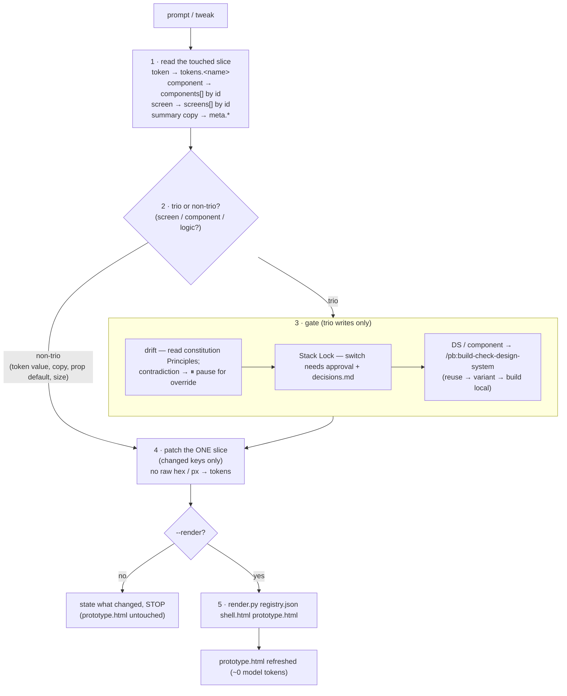
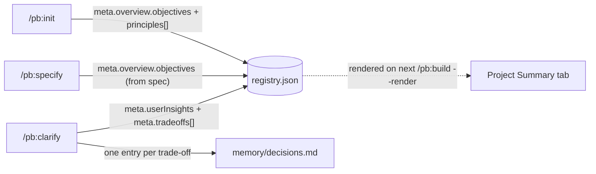
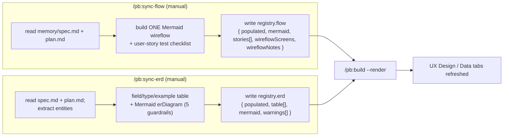
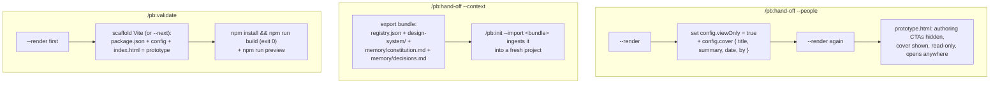

# Data flow — Product Builder v1.3.0

How data moves through Product Builder: the cheap build loop, the Tab-2 sync fold, the decoupled
syncs, and the two exits. See [architecture](architecture.md) for the static picture and the
[router](../CLAUDE.md) for the load-bearing rules.

## The one invariant

```
registry.json  =  state (the model edits this)
prototype.html =  view  (the generator produces this; never hand-edited, never the source of truth)
```

Every flow below reads/writes `registry.json` and only ever produces `prototype.html` through the
deterministic generator (`pb/tools/render.py`).

## The cheap build loop (`/pb:build`)

The loop reads/edits **only the touched slice** and is **trio-gated** — the drift/Stack/DS gate
runs only when a change touches a screen, a component, or logic. It **never** renders
`prototype.html` per tweak; `--render` regenerates it on demand.



Key points:

- **Read the slice, not the file.** The loop never loads the whole registry and never reads
  `prototype.html` to make an edit.
- **Gate-skip is a hard rule.** Never run the full gate ceremony on a non-trio tweak; never skip
  it on a trio write. A drift contradiction pauses with `⏸ DRIFT` and, on override, appends to
  `memory/decisions.md`.
- **The patch is minimal.** Only the changed keys of the one touched slice are written. New
  components/screens append an entry with a kebab-case `id`, a `renderFn`, and a `renderSrc`, plus
  a `render/{components,screens}/<id>.js` body file holding the render code (v1.4 schema 4).
- **Render is batched + deterministic.** Step 5 shells out to the generator; the model never
  hand-emits HTML (the G0.5 spike proved that ~2–3× worse).

### Worked example (from the G3 demo)

| Change | Classified | Gate | Touched | `prototype.html` |
|---|---|---|---|---|
| Tweak a token value | non-trio | skipped | `tokens.<name>.value` | unchanged until `--render` |
| "Add an OTP error state" | trio (logic) | **fires** — reads constitution, principles shape a compliant patch (error text + `--danger` token, no raw hex) | the screen/component slice | unchanged until `--render` |

## The Tab-2 sync fold (no hook)

The v0.4.0 `after_*` hooks + `sync-tab2` are gone. Project Summary (Tab 2) is now written
**directly from the on-ramp command bodies** into `registry.json` — then rendered later via the
normal `--render`.



- `/pb:init` writes the PRD objective + the constitution Principles as `[{num,title,body}]`.
- `/pb:specify` writes the spec's Objective.
- `/pb:clarify` writes User Insights + UI Logic Trade-offs, and appends one `decisions.md` entry
  per trade-off (`## <date> — <title>` · Decision · Why · Alternatives · Affects).

These bodies write data and **do not render** — the view catches up at the next `--render`.

## The decoupled syncs (UX Design + Data)

Flow (Tab 3) and Data (Tab 5) are **decoupled** — they never auto-fire from `/pb:build` and run no
drift check. Each writes its own slice of the registry, then renders.



- **`/pb:sync-flow`** — one `flowchart LR` (the 18 wireflow rules), wireflow nodes whose labels
  match `registry.screens[].name`, plus a numbered test checklist. Writes `registry.flow`, then
  `--render`.
- **`/pb:sync-erd`** — entities → a field/type/example table + an `erDiagram`, run through the 5
  guardrails (PK, FK, cardinality, PascalCase-singular naming, completeness); warnings become a
  prepended TODO block. Writes `registry.erd`, then `--render`.
- **`/pb:check-drift`** — read-only audit of the trio (screens · components · logic) against the
  constitution Principles. Produces a report only; **never** writes `registry.json` or
  `prototype.html`. (`--save` writes the report to `memory/drift-reports/`.)

## Figma hand-off (`/pb:build-figma-handoff`)

A **one-way** registry → Figma transfer through the Figma MCP, gated G-FP0 → G-FP5 before any
irreversible write. DS-neutral: the match library is `dsMatch.library` from config, never
hardcoded. After a successful push it writes the Figma IDs **back** onto the matching
`components[]` / `screens[]` entries (`figmaId`, `figmaComponentSetId`, `dsMatch`, `figmaFrameId`)
and only those keys — so the next push reconciles instead of duplicating. Roll-forward only.

## The two exits



- **`--people`** renders, flips `config.viewOnly` + writes `config.cover`, and re-renders — the
  shell then hides every authoring CTA across all 5 tabs and shows the cover. Safe to share with
  non-builders.
- **`--context`** exports a portable bundle (registry + DS + the why-log + the locks) that
  `/pb:init --import` ingests to continue the work elsewhere.
- **`/pb:validate`** renders first, scaffolds a runnable Vite/Next build from `prototype.html`, and
  confirms `npm run build` exits 0.

Both hand-off modes and validate **render first** — never hand off or scaffold from a stale view.
